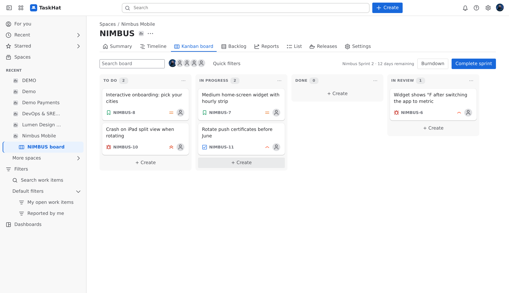
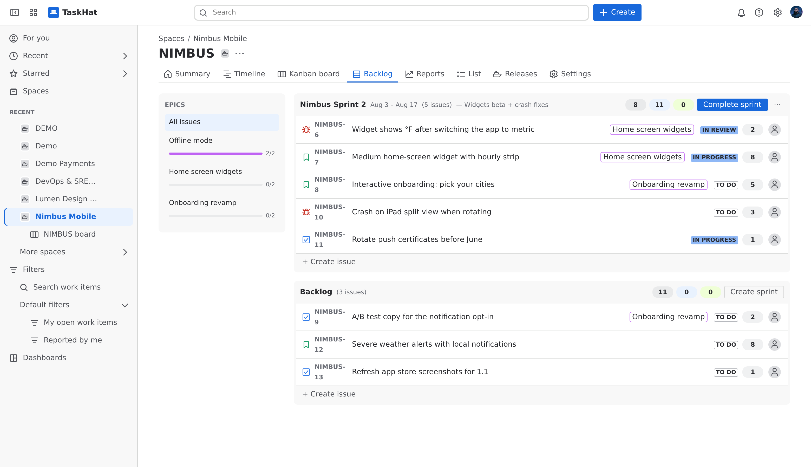
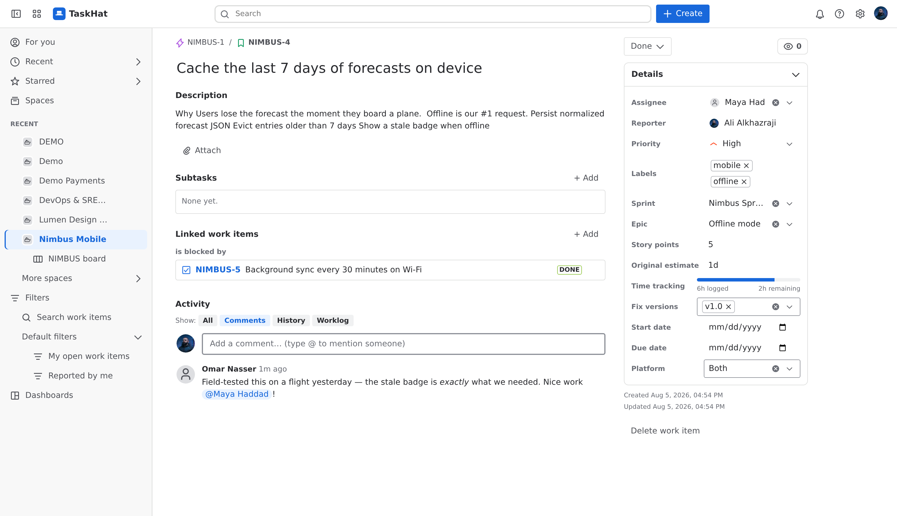
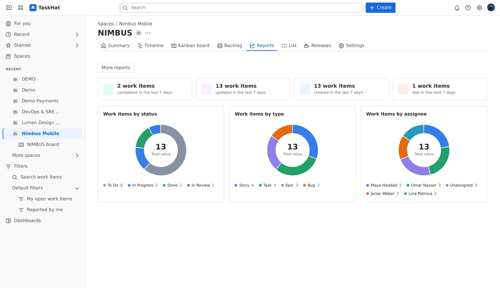
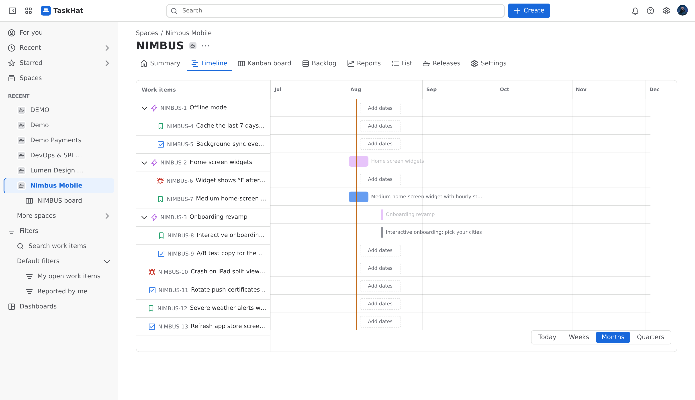
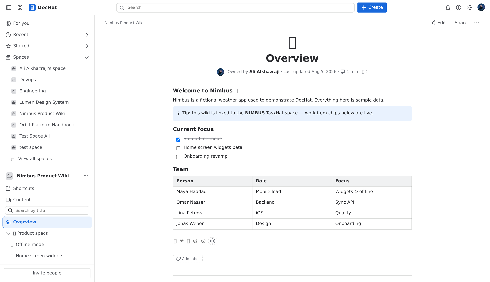
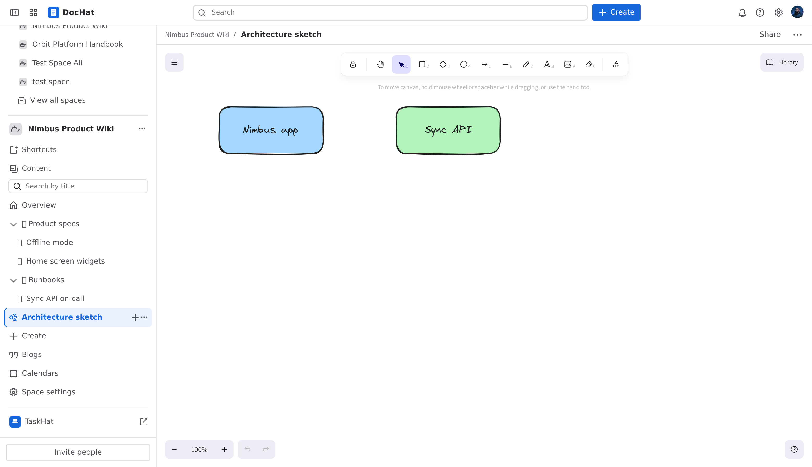

<div align="center">

# 🎩 TaskHat

**Self-hosted Jira + Confluence alternative in one app.**

Project tracking, sprints, automation and reports — plus DocHat, a full wiki
with whiteboards, blogs and calendars. Import your real Jira and Confluence
data with one click and keep working.

[**🚀 Try the live demo**](https://taskhat-demo.syshat.com) · read-only, no signup

[](LICENSE)
[](backend/)
[](frontend/)



</div>

---

## Why TaskHat?

- **Familiar from day one** — the UI follows the layout your team already
  knows from Jira and Confluence, so there is nothing to relearn.
- **Your data stays yours** — single Docker Compose or Helm deployment on
  your own infrastructure. Postgres, Redis and RabbitMQ; S3-compatible
  object storage for attachments.
- **Bring your history with you** — the importer pulls a whole Jira project
  (statuses, work types, boards, sprints, comments, worklogs, attachments,
  changelog, custom fields, story points, estimates…) and whole Confluence
  spaces (page trees, images, attachments, owners) via their Cloud APIs,
  idempotently — re-run any time.

## TaskHat — project tracking

| | |
|---|---|
| **Boards & sprints** — kanban and scrum boards, backlog grooming, sprint planning, burndown | **Work items** — epics, stories, tasks, bugs, subtasks; rich-text editor, comments with @mentions, attachments, watchers, history |
| **Workflows** — per-space statuses and transitions with a visual editor and rules | **Automation** — Jira-style When/If/Then rule builder with branches, smart values and scheduled rules |
| **Reports** — sprint burndown, cumulative flow, control chart, created vs resolved, and a dozen more | **Search** — TQL, a JQL-style query language, plus saved filters and quick search |
| **Timeline** — Gantt-style planning with dependencies | **Releases** — versions, release tracking, time tracking with worklogs |
| **Admin** — users & invites, permission schemes, custom fields & work types, webhooks, API tokens, audit log, 2FA + SSO (OIDC), incoming mail → work items | **i18n** — English and Arabic with full RTL |

<div align="center">

<br/><br/>

<br/><br/>

<br/><br/>

</div>

## DocHat — the wiki half

Spaces with page trees, a Confluence-style rich editor (tables, panels, task
lists, statuses, macros), page versions & restore, inline + page comments,
labels, templates, blogs, calendars, permissions — and **live-collaborative
whiteboards**. Work items and wiki pages link both ways with live chips.

<div align="center">

<br/><br/>

</div>

## Quick start

```bash
git clone https://github.com/ali-automation/taskhat.git
cd taskhat
docker compose up -d
# open http://localhost:8080 — the first account you register becomes the site admin
```

That's it: Postgres, Redis, RabbitMQ, the API, the background worker and the
web UI, all wired. Migrations run automatically.

### Import your Jira / Confluence data

Admin → Import: paste your Atlassian site URL, e-mail and API token, pick a
project or space, review the dry-run mapping report, run. Imports are
idempotent — re-running updates in place.

### Deploy to Kubernetes

A production Helm chart lives in [`deploy/helm/taskhat`](deploy/helm/taskhat)
(bundled or external Postgres/Redis/RabbitMQ, S3 storage, ingress + TLS,
SOPS-friendly secret values). Start from
[`examples/values-production.yaml`](deploy/helm/taskhat/examples/values-production.yaml).

### Demo mode

Set `TASKHAT_DEMO_MODE=true` to add an "Explore the live demo" button that
signs visitors into a shared, **server-side read-only** guest account — plus
an admin one-click sample dataset (three project spaces + three wiki spaces)
to give them something to look at.

## Documentation

Architecture, data model, API design and the full feature roadmap live in
[`documentation/`](documentation/).

## License

[AGPL-3.0](LICENSE). Run it, self-host it, fork it — if you offer a modified
TaskHat as a network service, share your changes under the same license.

Jira® and Confluence® are registered trademarks of Atlassian. TaskHat is an
independent project, not affiliated with or endorsed by Atlassian.
